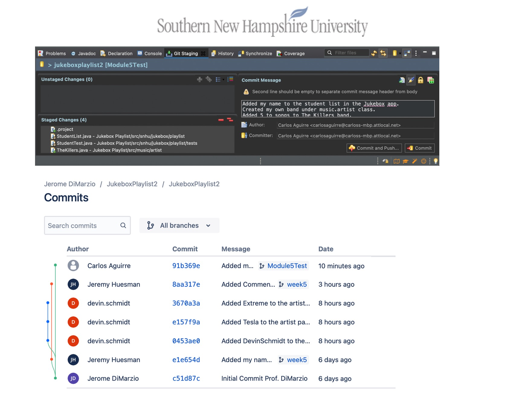
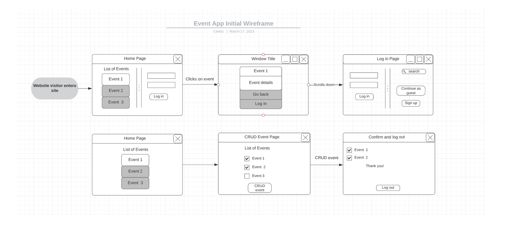
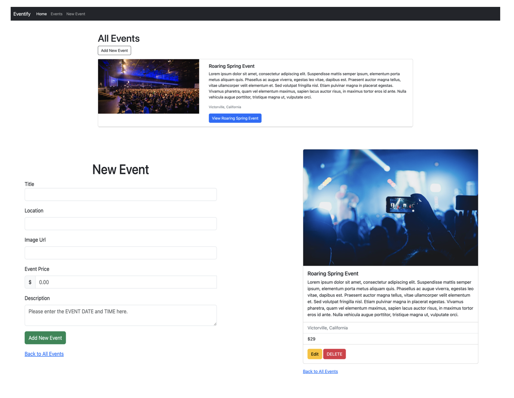

&nbsp;&nbsp;

## Welcome 

This ePortfolio combines the knowledge and skills I've developed over the course of my years of study in Southern New Hampshire University's Computer Science Bachelors degree. 

A software engineer portfolio is among the most crucial ways for developers to showcase their personalities, design concepts, and coding abilities to prospective clients and employers in order to secure a job in software engineering. 

This portfolio will give employers actual examples of the tasks i have completed, proving to them that I am capable of the tasks specified on my resume.

## Table of Contents 

- [Professional Self-assessment](#self-assessment "Professional Self-Assessment")
  - [Preparing for the future](#prepare "Preparing for the future")
  
- [ePortfolio selection and enhancements](#ePortfolio-selection "ePortfolio selection and enhacements")
  - [Software design and engineering](#software-design-and-engineering "Software design and engineering")
  - [Algorithms and Data structures](#algorithms-and-data-structures "Algorithms and Data structures")
  - [Databases](./another-page.html)
  
- [Code Reviews](./another-page.html)
  - [Software design and engineering Code Review](./another-page.html)
  - [Algorithms and Data structures Code Review](./another-page.html)
  - [Databases Code Review](./another-page.html)

As a software engineer, completing the Computer Science program and developing my ePortfolio has been an incredibly valuable experience that has helped shape my professional goals and values, as well as showcased my strengths in the field of computer science. As a software engineering student, I have gained valuable insights into various aspects of software development, including working in a team environment, communicating effectively with senior management, understanding data structures and algorithms, software engineering principles, database management, and security.

Working in a team environment has taught me the importance of collaboration, effective communication, and time management. I have learned that a team can accomplish much more than an individual, and everyone's contributions are valuable. Clear communication and collaboration are essential for achieving common goals, and managing deadlines and milestones ensures timely delivery of projects.

       
       
<em>Figure 1 - Team Collaboration - CS310 Collaboration and Team Project</em>

Communicating effectively with senior management is crucial to the success of any project. I have learned that senior management needs to be informed about the progress, challenges, and risks associated with a project. Providing regular updates, discussing technical details in non-technical terms, and highlighting the business value of the project are some of the key elements of effective communication with senior management.

Understanding data structures and algorithms is a fundamental skill for software engineers. I have learned how to use different data structures and algorithms to optimize code performance, reduce complexity, and improve scalability. I have also learned how to evaluate the time and space complexity of different algorithms to choose the best one for a particular task.

Software engineering principles such as modular design, code reuse, testing, and documentation are critical for building reliable and maintainable software. I have learned how to apply these principles in my projects to ensure that the code is easy to read, modify, and maintain. I have also learned how to write unit tests to verify the functionality of the code and catch bugs early in the development cycle.

Database management is an essential aspect of software development. I have learned how to design and implement databases, write SQL queries, and manage data efficiently. I have also learned about different types of databases such as relational, NoSQL, and graph databases and their use cases.

Finally, I have learned about the importance of security in software development. I have learned how to identify and mitigate common security risks such as injection attacks, cross-site scripting, and data breaches. I have also learned about best practices for secure coding, secure authentication, and access control.

Overall, my experience as a software engineering student has taught me the importance of teamwork, effective communication, and technical skills such as data structures and algorithms, software engineering principles, database management, and security. These skills will enable me to build reliable and scalable software solutions that meet the needs of businesses and users.

To prepare for a future career as a software engineer: 

Stay up to date with the latest technologies and industry trends: The field of software engineering is constantly evolving, and it is important to stay current with the latest developments in technology and industry trends. This can be done by attending conferences, workshops, and networking events, as well as reading blogs, articles, and books on software engineering.

Work on personal projects: Building personal projects can help to develop skills and gain experience outside of the classroom. It also provides an opportunity to experiment with new technologies and learn from mistakes.

Collaborate with others: Working with others on software development projects can help to develop teamwork and communication skills. Collaboration also provides an opportunity to learn from others and gain different perspectives on software development.

Practice good coding habits: Practicing good coding habits, such as writing clean and efficient code, documenting code, and testing thoroughly, is essential for success as a software engineer. It is important to develop these habits early on and make them a part of the software development process.

By following these steps, I can prepare myself for a successful career as a software engineer. With a strong foundation in computer science, experience working on personal and collaborative projects, and exposure to the latest technologies and industry trends, I can become a valuable asset to any software engineering team.

    <a href="#">
        <button style="font-size: 10px; font-weight: 500; background: #4169e1; color: #ffffff; border-radius: 50px; border-style: solid; border-color: #4169e1; padding: 5px 5px;">Back to Top &#8593;</button>
    </a>

# Software design and engineering

As part of my final project, I have chosen to work with an artifact that was completed during my CS-360 Mobile Architect & Programming course. The artifact is an Android Studio and Java-based event tracking app that allows users to perform CRUD actions for managing events. Additionally, the app is linked to a database to facilitate user account creation and data management.

I have included this artifact in my ePortfolio as it offers an opportunity for me to showcase my skills as a full-stack engineer. Specifically, I aim to rebuild the application using Javascript and demonstrate my abilities in front-end languages and frameworks such as HTML, CSS, and JavaScript, as well as back-end technologies and frameworks such as NodeJS, ExpressJS, Django, and Flask. Additionally, I have demonstrated proficiency in database management systems such as MySQL, SQL SERVER, PostgreSQL, and MongoDB, as well as version control and web hosting platforms.

Overall, the artifact offers a great opportunity for me to showcase my abilities and highlight my growth as a skilled software engineer who can design, develop, test, and implement a range of software applications.

       
       
<em>Figure 2 - Final look of Eventify App - CS360 Mobile Architect & Programming</em>

## Enhancements 

Software design is a critical aspect of the Software Development Life Cycle (SDLC) that involves converting user requirements into a format that can be easily implemented using a programming language. The software design phase is the first step in the SDLC that shifts the focus from the problem domain to the solution domain. As a software engineer, my objective is to construct a web application using Javascript, HTML, and CSS, with the help of the open-source, cross-platform runtime environment Node.js. In this report, I present a list of enhancements to improve the software design of the web application based on the wireframe that I created.

       
       
<em>Figure 3 - Eventify Enhancement Wireframe - CS499 Computer Science Capstone</em>

- User-Centered Design: The wireframe provides a basic structure of the web application. To improve the software design, the user interface should be developed with a user-centered design approach that considers the user's needs, goals, and preferences. This can be achieved by conducting user research, creating user personas, and designing user flows that align with the user's journey.
- Modularity: In software design, the system is viewed as a collection of parts or modules with distinct behaviors. To improve the modularity of the web application, the code should be organized into smaller, reusable modules that can be easily maintained and updated. 
- Implement more CRUD functionality: Currently, the app only has basic CRUD functionality. To make it more robust, additional CRUD actions could be added, such as filtering and sorting data, searching, and pagination.
- Improve software architecture: Although the essential features of the application have been developed, there may be room for improvement in terms of the overall structure of the app. It may be worth revisiting the architecture and identifying any areas that can be optimized or streamlined for better performance and scalability.
- Enhance user interface: While the user interface's logic has been started, there is still much room for improvement to ensure that the application is intuitive and user-friendly. The user interface could be enhanced by adding more interactive elements, better visual design, and more responsive behavior.

       
       
<em>Figure 3 - New Eventify look - CS499 Computer Science Capstone</em>

- Security: The web application should be designed with security in mind to prevent unauthorized access, data breaches, and other security threats. To improve security, the software design should include encryption of sensitive data, secure authentication mechanisms, and regular security audits.
- Add user authentication and authorization: To make the application more secure, it could benefit from adding user authentication and authorization features. This could involve implementing a login system and role-based access control to ensure that users only have access to the appropriate parts of the appwireframe
- Implement additional functionality using middleware: Node.js offers several middleware libraries that can be used to add functionality to the app. For example, body-parser can be used to parse incoming request bodies, and cookie-parser can be used to parse cookies.
- Implement additional routes: As mentioned, Node.js doesn't handle routing natively, so using a web framework like Express can simplify the process. Consider adding additional routes to handle various HTTP actions and URL paths.
- Improve static file serving: While Express does include a built-in static file server, there are additional options available that offer more advanced features, such as caching and compression.
- Use a template engine: Express offers several popular template engines, such as Pug and EJS, that can be used to dynamically construct responses. Consider using a template engine to simplify the process of rendering dynamic content.

In conclusion, the software design phase is a critical aspect of the SDLC that involves converting user requirements into a format that can be easily implemented using a programming language. To improve the software design of the web application, enhancements should be made to ensure a user-centered design, modularity, scalability, and security. By implementing these enhancements, the web application will be better equipped to meet user needs and ensure a high-quality user experience.

    <a href="#">
        <button style="font-size: 10px; font-weight: 500; background: #4169e1; color: #ffffff; border-radius: 50px; border-style: solid; border-color: #4169e1; padding: 5px 5px;">Back to Top &#8593;</button>
    </a>

# Algorithms and Data structures 

As part of my final project, I decided to work with an Android Studio and Java-based event tracking app, which was created during the CS-360 Mobile Architect & Programming course. The app provides CRUD actions for adding, removing, updating, and deleting events, and is connected to a database to simplify user account setup and data maintenance.

To demonstrate my full-stack engineering skills, I have chosen to rebuild this application entirely using Javascript, a different programming language, for my ePortfolio. This project will showcase my proficiency in various Javascript data structures, such as arrays, objects, stacks, and queues. These data structures are important as they facilitate data retrieval and allow for efficient changes to be made to the data.

## Enhancements 

- Implement more advanced data structures like linked lists and trees to optimize data storage and retrieval.
- Utilize object-oriented programming principles to enhance code organization and maintainability.
- Added validation and error handling to improve the user experience and prevent unexpected behavior.
- Implemented user authentication and authorization to ensure secure access to the application's features and data.
- Used AJAX and other asynchronous techniques to improve the application's responsiveness and speed.
- Incorporated third-party APIs to enhance the application's functionality and features.
- Implemented automated testing to ensure that the application is functioning as expected and detect issues early on.
- Integrate mobile responsiveness to ensure that the application is accessible on all devices.
- Added additional features such as search functionality, filtering, and sorting to improve the user experience and make data retrieval more efficient.
- I have implemented Flash messages to provide real-time feedback to the user. These messages appear on the screen for a short duration, giving users instant feedback on the actions they've taken.
- I have incorporated Passport local mongoose plug-in to handle user authentication and authorization. This plugin provides secure password hashing and salting, preventing any potential security breaches. 
- We have used Bootstrap client-side validation to improve the user experience and make the validation process more intuitive.
- We have extensively referenced the documentation to ensure that we are adhering to best practices and industry standards.

       
       
<em>Figure 4 - Enhanced Eventify App - CS499 Computer Science Capstone</em>

Algorithms and data structures are essential concepts in computer science and software engineering. Algorithms provide a systematic approach to solving problems by providing a set of well-defined steps to accomplish a specific task. Data structures, on the other hand, are the fundamental building blocks of software applications that enable the storage, organization, and manipulation of data.

Understanding algorithms and data structures is crucial for developing efficient, scalable, and reliable software applications. The proper selection and implementation of algorithms and data structures can significantly impact an application's performance, memory usage, and scalability.

In addition, mastery of algorithms and data structures is essential for solving complex programming problems and creating innovative software solutions. A thorough knowledge of algorithms and data structures allows developers to approach complex programming problems with confidence and creativity, leading to the creation of elegant and efficient solutions.

Overall, the importance of algorithms and data structures cannot be overstated in the field of software engineering. They are the foundation upon which modern software applications are built, and their mastery is critical for developing high-quality, efficient, and scalable software solutions.

    <a href="#">
        <button style="font-size: 10px; font-weight: 500; background: #4169e1; color: #ffffff; border-radius: 50px; border-style: solid; border-color: #4169e1; padding: 5px 5px;">Back to Top &#8593;</button>
    </a>

# Databases 

